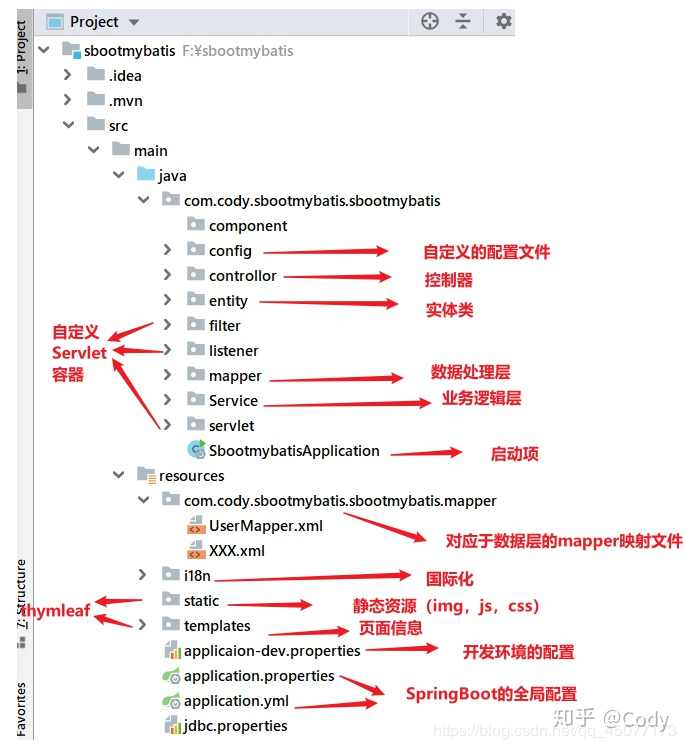

#### 简介

MyBatis框架是一个开源的数据持久层框架。它的内部封装了通过JDBC访问数据库的操作，支持普通的SQL查询、存储过程和高级映射，几乎消除了所有的JDBC代码和参数的手工设置以及结果集的检索。MyBatis作为持久层框架，其主要思想是将程序中的大量SQL语句剥离出来，配置在配置文件当中，实现SQL的灵活配置。这样做的好处是将SQL与程序代码分离，可以在不修改代码的情况下，直接在配置文件当中修改SQL。

#### MyBatis的优点
1.与JDBC相比，减少了50%以上的代码量。

2.MyBatis是最加简单的持久层框架，小巧并且简单易学。

3.MyBatis相当灵活，不会对应用程序或者数据库的现有设计强加任何影响，SQL写在XML文件里，从程序代码中彻底分离，降低耦合度，便于统一的管理和优化，并可重用。

4.提供XML标签，支持编写动态的SQL，满足不同的业务需求。

5.提供映射标签，支持对象与数据库的ORM字段关系映射。

#### MyBatis的缺点
1.SQL语句的编写工作量较大，对开发人员编写SQL的能力有一定的要求。

2.SQL语句依赖于数据库，导致数据库不具有好的移植性，不可以随便更换数据库。

#### 项目框架
