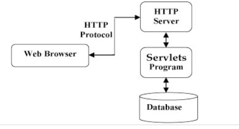
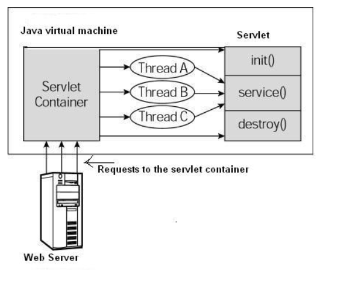

#### 简介
Java Servlet 是运行在 Web 服务器或应用服务器上的程序，它是作为来自 Web 浏览器或其他 HTTP 客户端的请求和 HTTP 服务器上的数据库或应用程序之间的中间层。

#### Servlet 架构

#### Servlet 任务

Servlet是JavaWeb的三大组件之一，它属于动态资源。Servlet的作用是处理请求，服务器会把接收来的请求交给Servlet来处理，在Servlet中通常需要：
1.接收请求数据。
2.处理请求。
3.完成响应。
例如客户端发出登录请求，或者输出注册请求，这些请求都应该由Servlet来完成处理。Servlet需要我们自己来编写。
#### Servlet 生命周期

1.Servlet 初始化后调用 init () 方法。

2.Servlet 调用 service() 方法来处理客户端的请求。

3.Servlet 销毁前调用 destroy() 方法。

4.最后，Servlet 是由 JVM 的垃圾回收器进行垃圾回收的。

##### 架构图

1.第一个到达服务器的 HTTP 请求被委派到 Servlet 容器。

2.Servlet 容器在调用 service() 方法之前加载 Servlet。

3.然后 Servlet 容器处理由多个线程产生的多个请求，每个线程执行一个单一的 Servlet 实例的 service() 方法。

